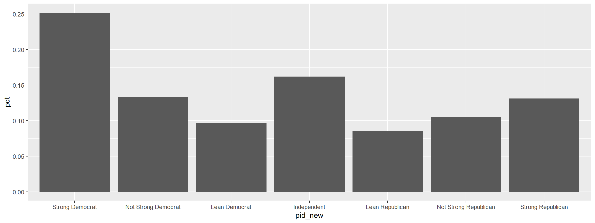

# SocSci: Functions for Analyzing Survey Data

## Author

Ryan Burge <https://www.ryanburge.net>

Instructor of Political Science, Eastern Illinois University, Charleston
IL

[](https://twitter.com/ryanburge)
[](https://saythanks.io/to/ryanburge)


-----

### Installation

You can install:

  - the latest development version from GitHub with
    
    ``` r
    install.packages("devtools")
    devtools::install_github("ryanburge/socsci")
    ```

### There are just a handful of functions to the package right now

## Counting Things

I love the functionality of tabyl, but it doesn’t take a weight
variable. Here’s the simple version `ct()`

``` r
library(socsci)
cces <- read_csv("https://raw.githubusercontent.com/ryanburge/blocks/master/cces.csv")

cces %>% 
  ct(race)
#> # A tibble: 8 x 3
#>    race     n   pct
#>   <int> <int> <dbl>
#> 1     1   368 0.736
#> 2     2    54 0.108
#> 3     3    38 0.076
#> 4     4    13 0.026
#> 5     5     7 0.014
#> 6     6     9 0.018
#> 7     7     8 0.016
#> 8     8     3 0.006
```

Note that you are presented with a count column and a pct column.

Let’s add weights

``` r
cces %>% 
  ct(race, commonweight_vv)
#> # A tibble: 8 x 3
#>    race       n   pct
#>   <int>   <dbl> <dbl>
#> 1     1 348.    0.758
#> 2     2  43.9   0.096
#> 3     3  34.0   0.074
#> 4     4   7.09  0.015
#> 5     5   3.87  0.008
#> 6     6  15.2   0.033
#> 7     7   6.33  0.014
#> 8     8   0.704 0.002
```

Notice that it’s pipeable. And if you don’t include the weight variable
then it won’t be calculated with a weight.

## Getting Confidence Intervals

Oftentimes in social science we like to see what our 95% confidence
intervals are, but that’s a lot of syntax. It’s easy with the `mean_ci`
function

``` r
cces %>% 
  mean_ci(gender)
#> # A tibble: 1 x 7
#>    mean    sd     n level     se lower upper
#>   <dbl> <dbl> <int> <dbl>  <dbl> <dbl> <dbl>
#> 1  1.54 0.499   500  0.05 0.0223  1.49  1.58
```

The default is a 95% confidence interval. However that can be changed
easily.

``` r
cces %>% 
  mean_ci(gender, ci = .84)
#> # A tibble: 1 x 7
#>    mean    sd     n level     se lower upper
#>   <dbl> <dbl> <int> <dbl>  <dbl> <dbl> <dbl>
#> 1  1.54 0.499   500  0.16 0.0223  1.50  1.57
```

This can also take weights.

``` r
cces %>% 
  mean_ci(gender, ci = .84, wt = commonweight_vv)
#> # A tibble: 1 x 6
#>    mean    sd     n     se lower upper
#>   <dbl> <dbl> <int>  <dbl> <dbl> <dbl>
#> 1  1.50 0.499   500 0.0223  1.47  1.53
```

## Simple Mean and Median

I wanted a simple function to calculate the mean and the median. It
takes just one variable and computes both
statistics.

``` r
money1 <- read_csv("https://raw.githubusercontent.com/ryanburge/pls2003_sp17/master/sal_work.csv")

money1 
#> # A tibble: 1,025 x 3
#>       X1 salary names             
#>    <int>  <int> <chr>             
#>  1     1  14736 Darin Casem       
#>  2     2  21261 Jaelyn Groesbeck  
#>  3     3  16831 Theodis Butler    
#>  4     4  34400 Joewid Rettig     
#>  5     5  31239 Breianna Gilbert  
#>  6     6  51580 Marcus Gray II    
#>  7     7  49699 Berenice Garcia   
#>  8     8  66805 Elijah Garrett    
#>  9     9  49321 Jeremiah Bishop Jr
#> 10    10  67126 Sultana al-Jabbour
#> # ... with 1,015 more rows

money1  %>% 
  mean_med(salary)
#> # A tibble: 1 x 2
#>       mean median
#>      <dbl>  <int>
#> 1 1247953.  35853
```

## Two Value Correlations

Here’s a simple function that generates a pearson correlation of two
variables with a p-value.

``` r
x <- c(1, 2, 3, 7, 5, 777, 6, 411, 8)
y <- c(11, 23, 1, 4, 6, 22455, 34, 22, 22)
z <- c(34, 3, 21, 4555, 75, 2, 3334, 1122, 22312)

test <- data.frame(x,y,z) %>% as.tibble()

test %>% 
  filter(z > 10) %>% 
  corr(x,y)
#> # A tibble: 1 x 8
#>   estimate statistic p.value     n conf.low conf.high method                               alternative
#>      <dbl>     <dbl>   <dbl> <int>    <dbl>     <dbl> <chr>                                <chr>      
#> 1    0.288     0.673   0.531     5   -0.594     0.856 Pearson's product-moment correlation two.sided
```

## Convert all NAs in a dataframe to Zero

``` r
x <- c(1, 2, 3, NA, 5, NA, 6, NA, 8)
y <- c(11, 23, NA, 4, 6, NA, NA, NA, 22)

df <- data.frame(x,y) %>% as.tibble()

df
#> # A tibble: 9 x 2
#>       x     y
#>   <dbl> <dbl>
#> 1     1    11
#> 2     2    23
#> 3     3    NA
#> 4    NA     4
#> 5     5     6
#> 6    NA    NA
#> 7     6    NA
#> 8    NA    NA
#> 9     8    22

na_zero(df, y)
#> # A tibble: 9 x 2
#>       x     y
#>   <dbl> <dbl>
#> 1     1    11
#> 2     2    23
#> 3     3     0
#> 4    NA     4
#> 5     5     6
#> 6    NA     0
#> 7     6     0
#> 8    NA     0
#> 9     8    22
```

## Bind Several Dataframes together

Oftentimes I make many little dataframes that I need to bind\_rows to
put into one large dataframe. As long as those dataframes have the same
naming convention that can be done.

``` r
dd1 <- data.frame(a = 1, b = 2)
dd2 <- data.frame(a = 3, b = 4)
dd3 <- data.frame(a = 5, b = 6) 

bind_df("dd")
#>   a b
#> 1 1 2
#> 2 3 4
#> 3 5 6
```

## Recode things and keep the factor levels

I recode all the time, but unfortunately when you recode from numeric to
character the factor levels are plotted in alphabetical order. There’s a
way around that now.

I found this [terrific
function](https://stackoverflow.com/questions/49572416/r-convert-to-factor-with-order-of-levels-same-with-case-when)
written by [Dennis
YL](https://stackoverflow.com/users/5068121/dennis-yl), where he had the
same problem that I
had.

``` r
cces <- read_csv("https://raw.githubusercontent.com/ryanburge/cces/master/CCES%20for%20Methods/small_cces.csv")

graph <- cces %>% 
  mutate(pid_new = frcode(pid7 == 1 ~ "Strong Democrat", 
                          pid7 == 2 ~ "Not Strong Democrat", 
                          pid7 == 3 ~ "Lean Democrat", 
                          pid7 == 4 ~ "Independent", 
                          pid7 == 5 ~ "Lean Republican", 
                          pid7 == 6 ~ "Not Strong Republican", 
                          pid7 == 7 ~ "Strong Republican", 
                          TRUE ~ "REMOVE")) %>% 
  ct(pid_new)


graph %>% 
  filter(pid_new != "REMOVE") %>% 
  ggplot(., aes(x = pid_new, y = pct)) +
  geom_col()
```

<!-- -->

  - let me know what you think on twitter
    <a href="https://twitter.com/ryanburge">@ryanburge</a>
